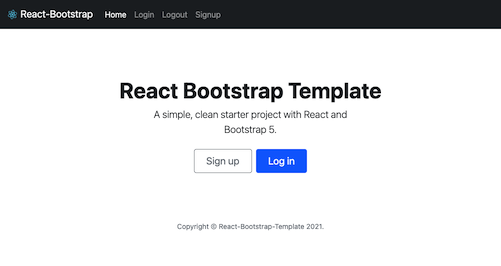

# React Bootstrap Project Template

A simple, clean starter project with React and Bootstrap 5.



## Setup

1. Runs the app in the development mode. Open [http://localhost:3000](http://localhost:3000) to view it in the browser.

   ```bash
   $ yarn start
   ```

   The page will reload if you make edits. You will also see any lint errors in the console.

1. Launches the test runner in the interactive watch mode.

   ```bash
   $ yarn test
   ```

1. Builds the app for production to the `build` folder. It correctly bundles React in production mode and optimizes the build for the best performance.

   ```bash
   $ yarn build
   ```
