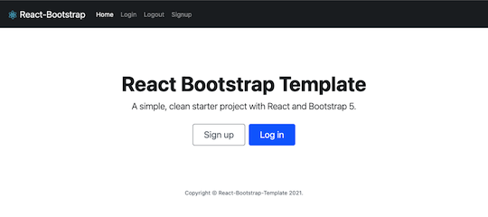
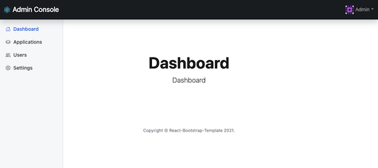

# React Bootstrap Starter Project

A simple, clean starter project with React and Bootstrap 5.

The public pages.


The restricted admin console.


## Motivation

Learning React through this project and motivated to create a boilerplate project that I (or anyone) can use. Here are some of the design principles for this project.

* Keep it simple.
* Use it for quick prototyping yet extensible enough for a production-ready project.
* Leverage `eslint` and `prettier` with the right amount of plugins and mix of configurations to maximize for developer productivity and code cleanliness.

## Setup

1. Runs the app in the development mode. Open [http://localhost:3000](http://localhost:3000) to view it in the browser.

   ```bash
   $ yarn start
   ```

   The page will reload if you make edits. You will also see any lint errors in the console.

1. Launches the test runner in the interactive watch mode.

   ```bash
   $ yarn test
   ```

1. Builds the app for production to the `build` folder. It correctly bundles React in production mode and optimizes the build for the best performance.

   ```bash
   $ yarn build
   ```

## Credits

* [Bootstrap 5 Examples](https://getbootstrap.com/docs/5.1/examples) - Used many of the examples on Bootstrap 5 website on this project.
* [Form validation with React Hook](https://felixgerschau.com/react-hooks-form-validation-typescript/) - Borrowed code to write a custom React Hook to handle a form, including validation.

## Reference

* [React Router v6](https://github.com/remix-run/react-router/)
